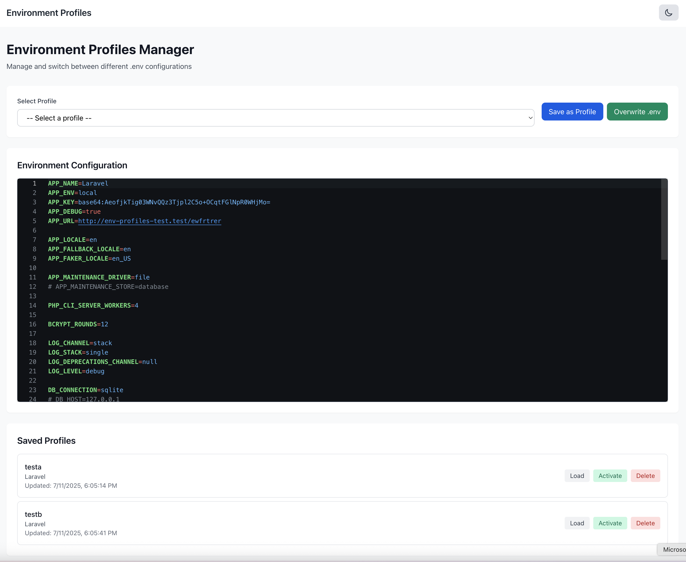

# Laravel Environment Profile Manager

[](https://github.com/laravel-ready/env-profile-manager/actions/workflows/tests.yml)
[](https://packagist.org/packages/laravel-ready/env-profile-manager)
[](https://packagist.org/packages/laravel-ready/env-profile-manager)
[](https://packagist.org/packages/laravel-ready/env-profile-manager)

A Laravel package for managing multiple environment configurations (.env files) with an intuitive web interface. Easily switch between different environment profiles, create backups, and manage your application's configuration.

## Features

- 🔄 **Multiple Environment Profiles**: Create and manage multiple .env configurations
- 🎨 **Modern Web Interface**: Vue 3 + Tailwind CSS interface with Monaco Editor
- 🌓 **Dark/Light Mode**: Built-in theme support with system preference detection
- 💾 **Automatic Backups**: Automatically backup .env files before changes
- 🏷️ **Application Names**: Optionally tag profiles with application names
- 🔒 **Secure**: Configurable middleware protection
- 📦 **Easy Installation**: Simple composer installation with publish commands
- 🚀 **Laravel 10/11/12 Support**: Compatible with latest Laravel versions
- 🔌 **API Support**: RESTful API endpoints for programmatic access

## Preview



## Requirements

- PHP 8.2 or higher
- Laravel 10.0 or higher

## Installation

1. Install the package via Composer:

```bash
composer require laravel-ready/env-profile-manager
```

2. Publish the package resources:

```bash
php artisan env-profile-manager:publish
```

Or publish specific resources:

```bash
# Publish config file
php artisan vendor:publish --tag=env-profile-manager-config

# Publish views (if you want to customize)
php artisan vendor:publish --tag=env-profile-manager-views

# Publish assets
php artisan vendor:publish --tag=env-profile-manager-assets

# Publish migrations
php artisan vendor:publish --tag=env-profile-manager-migrations
```

3. Run the migrations:

```bash
php artisan migrate
```

4. (Optional) Add CSRF token meta tag to your layout if not already present:

```html
<meta name="csrf-token" content="{{ csrf_token() }}">
```

## Configuration

The configuration file is published to `config/env-profile-manager.php`. Here are the available options:

```php
return [
    // Web route prefix
    'route_prefix' => 'env-profile-manager',
    
    // API route prefix
    'api_prefix' => 'api/env-profile-manager',
    
    // Middleware for web routes
    'middleware' => ['web', 'auth'],
    
    // Middleware for API routes
    'api_middleware' => ['api', 'auth:sanctum'],
    
    // Layout to extend for views
    // Set to null to use the package's default layout
    // Example: 'layouts.app' to use your application's layout
    'layout' => 'env-profile-manager::layouts.default',
    
    // Maximum number of .env backups to keep
    'max_backups' => 10,
    
    // Enable/disable features
    'features' => [
        'api' => true,
        'web_ui' => true,
        'backups' => true,
    ],
];
```

## Usage

### Web Interface

After installation, navigate to `/env-profile-manager` (or your configured route prefix) to access the web interface.

Features available in the web interface:

- View and edit current .env configuration
- Create new profiles from current configuration
- Load saved profiles
- Activate profiles (overwrites current .env)
- Delete profiles
- Real-time syntax highlighting with Monaco Editor

### API Endpoints

If API is enabled in configuration, the following endpoints are available:

- `GET /api/env-profile-manager` - List all profiles and current .env content
- `POST /api/env-profile-manager` - Create a new profile
- `GET /api/env-profile-manager/{id}` - Get a specific profile
- `PUT /api/env-profile-manager/{id}` - Update a profile
- `DELETE /api/env-profile-manager/{id}` - Delete a profile
- `POST /api/env-profile-manager/{id}/activate` - Activate a profile
- `GET /api/env-profile-manager/current-env` - Get current .env content
- `PUT /api/env-profile-manager/current-env` - Update current .env content

### Programmatic Usage

You can also use the package programmatically:

```php
use LaravelReady\EnvProfiles\Models\EnvProfile;
use LaravelReady\EnvProfiles\Services\EnvFileService;

// Create a new profile
$profile = EnvProfile::create([
    'name' => 'Production',
    'app_name' => 'My Laravel App',
    'content' => file_get_contents(base_path('.env.production')),
]);

// Activate a profile
$profile->activate();

// Use the EnvFileService
$envService = app(EnvFileService::class);
$currentEnv = $envService->read();
$envService->write($newContent);
```

## Security Considerations

1. **Protect Routes**: The package uses middleware configuration to protect routes. Make sure to configure appropriate middleware.

2. **Sensitive Data**: Be careful when storing sensitive data in profiles. Consider encrypting sensitive values.

3. **Backups**: The package automatically creates backups before modifying .env files. Configure `max_backups` to control disk usage.

## Customization

### Views

To customize the views, publish them and edit as needed:

```bash
php artisan vendor:publish --tag=env-profile-manager-views
```

Views will be published to `resources/views/vendor/env-profile-manager/`.

### Extending the Layout

By default, the package uses its own layout (`env-profile-manager::layouts.default`). You can use your application's layout by changing the configuration:

```php
'layout' => 'layouts.app',
```

Or set it to `null` to use the package's default layout:

```php
'layout' => null,
```

If using a custom layout, make sure it has a `@yield('content')` section and includes the necessary `@stack('styles')` and `@stack('scripts')` directives.

## Troubleshooting

### Monaco Editor Not Loading

Make sure your layout includes the style and script stacks:

```blade
@stack('styles')
@stack('scripts')
```

### CSRF Token Errors

Ensure your layout includes the CSRF token meta tag:

```html
<meta name="csrf-token" content="{{ csrf_token() }}">
```

### Permission Denied Errors

Check that the web server has write permissions for:

- The `.env` file
- The Laravel base directory (for creating backups)

## Contributing

Contributions are welcome! Please feel free to submit a Pull Request.

## License

This package is open-sourced software licensed under the [MIT license](LICENSE).
